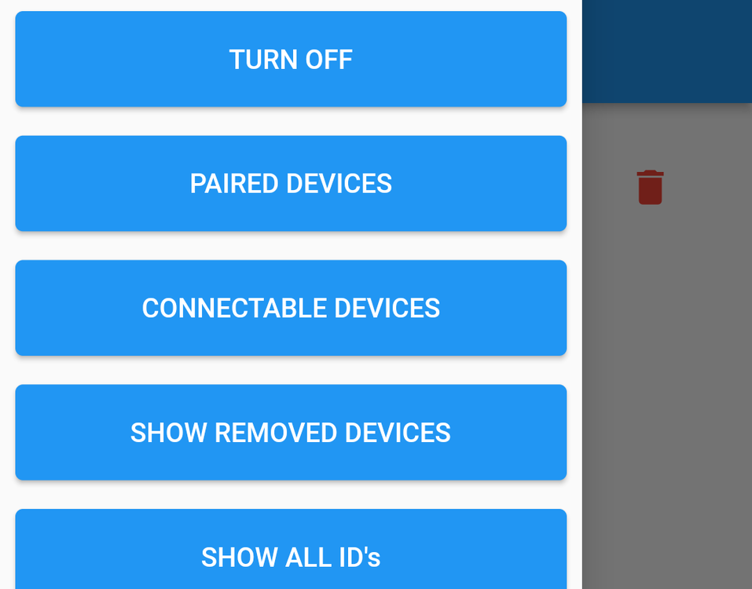
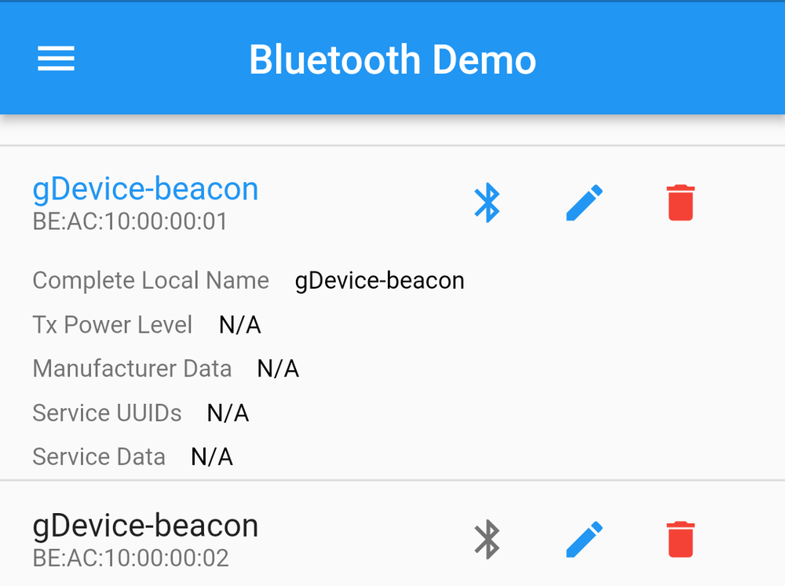
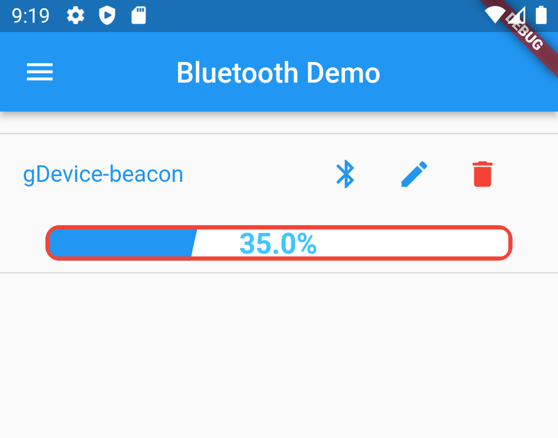

## [This Whole Project is for Connecting BLE]

Idea is from Baton App, Basically helps to connect with lower energy devices like Rasberry PI etc and Helps to fetch their battery level.

## Tech Used
> 1 Latest Flutter SDK version 3.0.0  
> 2 Package used Flutter Blue Plus.
 

## Demo Images 

* Intro Page  

* Sidebar

* List Devices

* Connected Device

